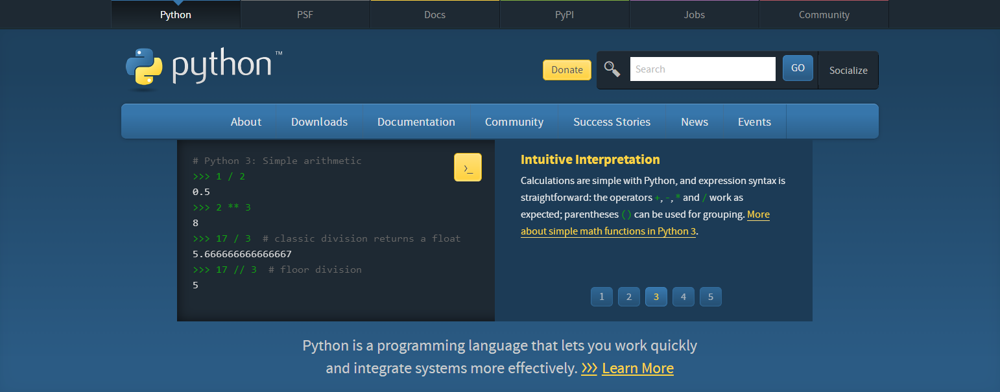

# **Markdown语言**

[Markdown](https://daringfireball.net/projects/markdown/)是一种轻量级  的标记语言，可与HTML语言兼容，可以看做是[HTML语言](https://www.runoob.com/html/html-editors.html)的简易版本，2004年由John Gruber创建。Markdown语言主要用于编写文档及论坛发表消息，如[github](https://github.com/)的read.me文档，[jupyterlab](https://jupyterlab.readthedocs.io/en/latest/)文本的编写。
## **多级标题**
```
# 一级标题
## 二级标题
...
###### 六级标题
```
# 一级标题
## 二级标题
...
###### 六级标题
## **段落样式**

　　**空行:** 通过文本间空行实现

　　这是第一段
  
　　这是第二段

## **空格:**   
　　中文输入　状态下，按shift+空格切换到全角状态，然后按空格    
  

## **文字样式:**
```
   斜体采用 *斜体*　粗体采用 **粗体**　粗斜体采用 ***粗斜体***
```
　　*斜体*　**粗体**　***粗斜体***

## **分割线:** 
```
　　可以采用三个以上的下划线___ 
```
_______

## **下划线**
```
　　采用HTML语言的underline标签实现 <u> </u>
　　<u>通过HTML的标签实现</u>
```
   <u>通过HTML的标签实现</u>

## **字体颜色**
```
　　采用HTML font标签实现 <font color="red">内容</font>
```
<font color="green">　　字体颜色通过HTML字体颜色标签实现</font>

## **有序与无序列表**
```
* 无序列表
* 无序列表
1. 有序列表
2. 有序列表
```
* 无序列表
* 无序列表
1. 有序列表
2. 有序列表

## **区块引用**
```
> 区块引用1   
>> 区块引用2
```
> 区块引用1   
>> 区块引用2
>>> 区块引用3

## 代码块
     
>  \``` Python    
>  print ("Hello world!")     
>  \```            
    

``` Python
print ("Hello world!")
``` 

## 地址与图片链接
```
网址链接：[python官网](https://www.python.org)    
图片链接： 
```
[python官网](https://www.python.org/)   


## 表格
```
　　采用|分割单元格，采用----分割标题栏与单元格。单元格的对齐采用:,如左对齐(:----)

| 左对齐 | 右对齐 | 居中对齐 |
| :------|------:| :-----: |
| 单元格 | 单元格 | 单元格 |
| 单元格 | 单元格 | 单元格 |
| 左对齐 | 右对齐 | 居中对齐 |
| :-----|----:| :----: |
| 单元格 | 单元格 | 单元格 |
| 单元格 | 单元格 | 单元格 |
```    
| 左对齐 | 右对齐 | 居中对齐 |
| :------|------:| :-----: |
| 单元格 | 单元格 | 单元格 |
| 单元格 | 单元格 | 单元格 |
| 左对齐 | 右对齐 | 居中对齐 |
| :-----|----:| :----: |
| 单元格 | 单元格 | 单元格 |
| 单元格 | 单元格 | 单元格 |

# Python语言

## python语言及其特点

### python语言的发展    
　　Guido von Rossum 1989年开发了python编译器。python语言介于C语言与脚本语言之间，是一种“胶水”语言。python语言的宗旨就是“能用胶水解决的问题，坚决不造轮子”。发展的版本有2.x和3.x，[python官网](https://www.python.org/)      


  

### python语言下载及安装
1. 在下载页面选择相应系统对应的版本进行下载


2. 安装python，可以选择相应的安装目录，添加python到系统路径


3. 进入python安装目录Scripts进行安装需要的模块，安装好的模块位于site-pakages


### python常用编辑器介绍


　　[editPlus](https://www.editplus.com/)， [pyCharm](https://www.jetbrains.com/pycharm/)，
[anaConda](https://www.anaconda.com/)等


### python语言的特点

**优点**
* 简洁优雅，可读性强　　
* 可移植性强，接口强大
* 优秀强大的第三方库

**不足**
* 速度中等
* 不同版本及包的兼容性

### python的应用场景   

* 数值计算，依赖于众多的第三方包
* 机器学习及深度学习
* 网络爬虫及大数据分析
* 网页制作，知乎，facebook等
* 桌面程序的开发，依赖于pyQt，wxPython等第三方GUI库
* 与其他软件的交互，如Opensees,Abaqus,SAP2000等
...

### python与matlab对比

|<font size=4>matlab</font>|<font size=4>python</font>|
|:------:|:------:|
|<font size=4>商业软件</font>|<font size=4>免费开源</font>|
|<font size=4>软件冗杂</font>|<font size=4>即用即装</font>|
|<font size=4>面向过程</font>|<font size=4>面向对象</font>|
|<font size=4>速度慢</font>|<font size=4>速度快</font>|
|<font size=4>发展缓慢</font>|<font size=4>发展极快</font>|
|<font size=4>...</font>|<font size=4>...</font>|

## python语言基础语言

### 数据类型

数字：整型(int)  浮点型 (float)


```python
print (type(2)) #type()函数返回输入数据的类型
print (type(2.0)) #print ()函数用于文本输出
```


```python
a=float(2) #整型转换为浮点型
b=int(2.0) #浮点型转换为整型
print (a)
print (b)
```

    2.0
    2
    

字符串：'' ""


```python
a="hello world!"
b="我是python"
print (type(a))
print (a)
print (a+b)
```

    <class 'str'>
    hello world!
    hello world!我是python
    

Math模块


```python
from math import * #导入math模块中所有函数
a=sqrt(2)
print (a)
```

    1.4142135623730951
    

布尔类型：真(True)，假(False)


```python
a=True
b=False
print(int(a))
print(int(b))
```

    1
    0
    

### 数据结构

#### 列表(list)


```python
a=[] #空列表
print (a)
b=[1,8,3,6]
print (b[0])
b.append(7) #从列表尾部不断添加新对象
print (b[-1])
b.reverse() #反转列表中元素
print (b)
b.sort() #列表排序
print (b)
f=len(b) #列表的长度
print (f)
```

可以通过help函数与dir函数查看模块内所有的特性


```python
print (dir(list)) #特殊方法与公共方法列表
```


```python
print (help(list)) #返回各个方法的具体定义
```

#### 元组(tuple)

元组与列表类似，区别在于一旦创建不能对其进行修改   
元组可应用于不可变量的存放，既快又安全，需要修改时可以先转化为列表


```python
a=(2,3,2,5,1)
b=list(a)
b.append(8)
print (b)
```

#### 字典(dict)

字典(dict)是键与值一一映射的一种数据结构 {key:value}


```python
a={"one":21,"two":43,"three":54} #三个元素的字典
print (a)
print (list(a.keys())) #返回字典a的所有键
print (list(a.values())) #f返回字典a的所有值
print (a["one"]) #返回特定键对应的值
```

列表解析：目的是简化代码


```python
a=[1,2,3,5]
b=[each*2 for each in a] #列表解析
print (b)
c={str(key1):value1 for key1,value1 in zip(a,b)} #列表解析
print (c)
d=(each1*2 for each1 in a)
print (d) #返回一个生成器
print (list(d))
```

    [2, 4, 6, 10]
    {'1': 2, '2': 4, '3': 6, '5': 10}
    <generator object <genexpr> at 0x000001E9917B9E08>
    [2, 4, 6, 10]
    

### 运算符
```
算术运算符: 加(+)，减(-),乘(*),除(/),乘方(**),求余(%)
比较运算符：等于(==),不等于(!=),大于(>),小于(<),大于等于(>=)等
赋值运算符：=，+=,*=等
逻辑运算符：与(and), 或(or),非(not)
成员运算符：in, not in
```
### 条件语句


```python
if (1>2) and (3>2) :
    print ("代码块1")
else:
    print ("代码块2")
   
```

    代码块2
    


```python
score=70
if 0<=score<60:
    print ("不及格")
elif 60<=score<80:
    print ("良好")
elif 80<=score<=100:
    print ("优秀")
else:
    print ("输入错误，请输入0到100之间的数字！")
```

    良好
    

### 循环语句


```python
for i1 in range(1,6,1):
    print (i1)
```


```python
flag=True
while flag: #第二种循环结构
    print ("It's true!")
    flag=False
print ("It's done!")
```

    It's true!
    It's done!
    


```python
a=[1,3,4,5,86,34]
for each in a:
    if each==max(a):
        print (each)
        break #跳出最近一层的循环
    else:
        print (each)
        continue #终止本轮循环，并进入下轮循环
        print ("我不是最大值！")
```

    1
    3
    4
    5
    86
    

### 函数（面向过程编程）


```python
def listSquare(inputList): #形参
    """ 
    描述：对列表中数字平方并返回列表
    输入：列表
    输出：平方后的列表
    例子：listSquare([1,2,3])
    """
    b=[each**2 for each in inputList]
    return b #返回值，可返回多个类型数据

print (help(listSquare)) #查看帮助文档
print (listSquare([1,2,3]))
print (listSquare(["a",2,3])) #引发程序异常
```

### 异常处理


```python
def listSquare(inputList): #形参
    """ 
    描述：对列表中数字平方并返回列表
    输入：列表
    输出：平方后的列表
    例子：listSquare([1,2,3])
    """
    try:
        b=[each**2 for each in inputList] #可能出现异常的代码块
    except TypeError: 处理，可以指出异常的类型，如TypeError
        print ("请输入数字型列表！")
        return #无正确返回，则返回None
    else: #没有异常，则执行如下代码
        return b #返回值，可返回多个类型数据

print (listSquare(["a",1,2]))
print (listSquare([1,2,3]))
```

### 类（面向对象编程的核心）

**类**=属性(数据)+方法(函数)   
**OOP特征**：封装(只提供借口），继承(避免重复造轮子），多态（方法名相　　　同，具体实现不同）等   
**以做菜为例:**   
**属性:**各种原材料与工具   
**方法:**切菜，炒菜等具体每一项工作   
**封装:**炒菜机（输入原材料，调用每一个方法，出菜，不需要知道细节   
**继承:**多功能炒菜机（炒青菜，土豆炖牛肉等菜）   
**多态:**子类炒青菜与子类土豆炖牛肉都有切菜这个共同方法，但具体操作不同   


```python
import numpy as np
import math
class IMs():#没有继承自任何类，默认继承自基类object
    """
    地震动强度指标计算类
    初始化参数：单列加速度时程acc(g),采样间隔t(s)
    方法：
    PGA()--返回峰值加速度值(g)
    PGV()--返回峰值速度值(cm/s)
    """
    def __init__(self,acc,t): #类的初始化方法，内置特殊方法
        #acc单列加速度时程(g),t时间间隔(s)
        self.acc=acc #self是类的实例化铭牌，在类内起到通信的作用
        self.t=t
        self.num=len(self.acc)

    def PGA(self):
        #返回acc的最大峰值加速度(PGA)(g)
        pga=b=np.fabs(self.acc).max()
        return pga
    
    def __AcctoVelocity (self): #类的私有化方法（前置两下划线）
        #将加速度(g)转换为速度(cm/s)
        vel=[0]
        acc=self.acc
        for i in range(self.num-1):
            velocity=(acc[i]+acc[i+1])*self.t/2*981+vel[-1]
            vel.append(velocity)
        return vel

    def PGV (self):
        #返回Velocity的最大峰值速度(PGV)(cm/s)
        veloc=self.__AcctoVelocity()
        pgv=b=np.fabs(veloc).max()
        return pgv
    
if __name__=='__main__':#测试用
    acc=np.loadtxt("acceleration.txt")#txt数据的加载
    imInstance=IMs(acc,0.01)#强度指标类的实例化
    pga=imInstance.PGA()#调用类中的方法计算PGA
    pgv=imInstance.PGV()
    print ("PGA=",round(pga,3),"g") #保留3位小数
```

    PGA= 1.219 g
    


```python
    print ("PGV=",round(pgv,3),"cm/s")
```

    PGV= 114.471 cm/s
    

### python学习资料

**常用网站：**

[matplotlib](https://matplotlib.org/)(第三方绘图库）   
[Numpy](https://numpy.org/)(科学计算基本库)    
[Scipy](https://www.scipy.org/)(集成了数学，科学及工程常用库)    
[SymPy](https://www.sympy.org/en/index.html)(符号运算库)    
[Python教程](https://docs.python.org/zh-cn/3/tutorial/index.html)(官方教程中文版)    
[Python标准库](https://docs.python.org/zh-cn/3/library/index.html)(Python内置标准库)    
[wxPython](https://www.wxpython.org/)(图形用户界面库)     
[pypi](https://pypi.org/search/?q=&o=&c=Operating+System+%3A%3A+Microsoft+%3A%3A+Windows)(大量第三方包库)     
[Scikit-learn](https://scikit-learn.org/stable/)(python机器学习库)   
[PyOpenGL](http://pyopengl.sourceforge.net/)(基于Python的图形开发库)    
[stackoverflow](https://stackoverflow.com/)(程序员交流答疑网站)    
[台大李宏毅机器学习](https://study.163.com/course/introduction/1208946807.htm)(中文机器学习经典课程)    
[斯坦福吴恩达机器学习](https://study.163.com/course/courseMain.htm?courseId=1004570029)(英文机器学习经典课程)    
[斯坦福吴恩达深度学习](https://mooc.study.163.com/smartSpec/detail/1001319001.htm)(英文深度学习经典课程)    
[github上python资源](https://github.com/Junjun1guo?tab=repositories) (收集了一些不错的python教程)    
[github](https://github.com/)(代码管理及发布网站，可以免费搭建个人博客)      
[MCMC](https://twiecki.io/blog/2015/11/10/mcmc-sampling/)(基于马尔科夫蒙特卡洛的贝叶斯模型)    

**推荐书籍:**

            
                  　
             

           　　
              　　　
               

             　　　
                 　
                

# python语言在桥梁工程中的应用

## 基于python语言的PEER网站地震波处理

　　主要涉及到python文件的操作,列表,字典及列表解析等   
　　完整的项目见[github-PEERMotionFormatProcess-with-Python](https://github.com/Junjun1guo/PEERMotionFormatProcess-with-Python)


```python
##########################################################################
import os
import numpy as np
import shutil
##########################################################################
def peerMotionProcess (fileName):
	"""
	Processing each file and return the processed resutls(percolumn data list, 
	timestep and pointers number)
	"""
	accList=[]
	fopen=open(fileName) #打开文件
	saveList1=[]
	saveList2=[]
	lines=fopen.readlines() #读取所有的行并返回列表
	for line_counter,line in enumerate(lines): #遍历行号及每行内容
		curLine=line.strip().split(" ") #去除首尾空格，并按行内空格划分
		removeSpace=[x for x in curLine if x!=""] #去除行内空格
		if line_counter<=3: #从前四行提取地震波点数与采样间隔
			[saveList1.append(x) for x in removeSpace] #前四行内容列表
		else:
			[saveList2.append(x) for x in removeSpace] #地震波时程点
	fopen.close() #关闭文件
	indexNumber=saveList1.index("NPTS=") #索引位置
	indexDt=saveList1.index("DT=")
	pointNumber=saveList1[indexNumber+1].split(",")[0] #提取数字
	deltaT=saveList1[indexDt+1].split(",")[0]
	saveList=[ float(x) for x in saveList2]
	return pointNumber,deltaT,saveList #返回地震波点数，采样间隔及时程列表
##########################################################################
if __name__=='__main__':
	direction=["E","N","V"]
	postFixList=[".AT2",".VT2",".DT2"]
	timeFileDict={".AT2":"Acceleration",".VT2":"Velocity",".DT2":"Displacement"}
	#Generating all saving file paths
	midirList=[(topFile,secFile) for topFile in timeFileDict.values() \
               for secFile in direction]
	#Clearing existing files
	[shutil.rmtree(x) for x in timeFileDict.values()]
	for toplevel,seclevel in midirList:
			os.makedirs(toplevel+"/"+seclevel)#generate save files
	fileListE=[]
	fileListN=[]
	fileListV=[]
	# text file read and process
	fileNameOpen=open("FileName.txt")
	for line in fileNameOpen.readlines():
		curLine=line.strip().split("\t") #分割同一行各个分量
		fileListE.append(curLine[0].split(".AT2")[0])#水平E向分量名称
		fileListN.append(curLine[1].split(".AT2")[0])#水平N向分量名称
		fileListV.append(curLine[2].split(".AT2")[0])#竖向V分量名称
	fileNameOpen.close()	
	finalLengthList=[]
	finaltimeList=[]
	finalFileNameList=[]
	for i1 in range(len(fileListE)): #遍历每条地震波
		fileNameENV=[{fileListE[i1]:direction[0]},{fileListN[i1]:direction[1]},\
                     {fileListV[i1]:direction[2]}]#将各个分量地震文件名与方向标签对应
		caseList=[(xx,yy) for xx in fileNameENV for yy in postFixList]#双循环实现每个
        #工况，总共9个，加速度，速度及位移文件夹下建E,N,V三个分量文件夹
		lengthList=[] #每条波点数列表
		timeList=[]#每条波采样间隔
		for eachCase in caseList:
			fileDirection=eachCase[0].values()[0]# eachCase[0]是字典，
            #选取的是方向E,N或者V
			filePrefix=eachCase[0].keys()[0].strip()#移除分量名首尾空格
			loadFilePath=os.path.join("downLoadPeerMotion/",filePrefix+eachCase[1])
            #地震动分量的相对路径
			if filePrefix=="NoFile":#判断地震动分量文件是否存在
				accPointNum=1e8 #对于不存在的文件设其点数为一大数
				accDeltaT=1e8
				accTimeHistory=[0.0]
			else:
				accResult=peerMotionProcess (loadFilePath) #调用地震波处理函数
				accPointNum=int(accResult[0])
				accDeltaT=float(accResult[1])
				accTimeHistory=accResult[2]
			lengthList.append(accPointNum)
			timeList.append(accDeltaT)
			cwd=os.getcwd() #返回当前工作目录
			savePathName=os.path.join(cwd,timeFileDict[eachCase[1]]+"/"+\
                                      fileDirection+"/",filePrefix+".txt")
             #文件保存路径
			np.savetxt(savePathName,accTimeHistory,fmt="%f") #保存处理后的地震波
		finalLengthList.append(min(lengthList)) #选取3个分量中最小值
		finaltimeList.append(min(timeList))
	np.savetxt("MotonLength.txt",finalLengthList,fmt="%d")
	np.savetxt("deltaT.txt",finaltimeList,fmt="%f")
```

## 基于模拟退火与三次B样条插值曲线的斜拉桥索力优化

　　主要涉及python与Opensees的交互，异常的处理等    
　　完整的项目见[github-Cable-force-optimization-of-a-curved-cable-stayed-bridge
](https://github.com/Junjun1guo/Cable-force-optimization-of-a-curved-cable-stayed-bridge)

## 基于wxPython的地震波处理GUI开发

　　主要涉及python桌面程序的开发等    
　　完整的项目见[github-seismicWaveAnalysis](https://github.com/Junjun1guo/seismicWaveAnalysis)

## 基于wxPython与PyOpenGL的有限元软件开发

　　主要涉及wxPython,PyOpenGL,类及设计模式等     
　　完整的项目见[git-2DTrussStructureAnalysisWithPython](https://github.com/Junjun1guo/2DTrussStructureAnalysisWithPython)

# 附录

## Jupyterlab 安装

1. 进入python安装目录Scripts文件夹，shift+ctrl+鼠标右键打开powershell窗口，或者在当前文件栏输入cmd进入命令行窗口

        
      

2. 在命令行输入：pip3 install jupyterlab开始自动安装


      

3. 在jupyter文件所在目录栏输入cmd进入命令行，输入jupyter lab打开，进入jupyterlab界面。关于jupyterlab的更多知识可参考[官方帮助文档](https://jupyterlab.readthedocs.io/en/latest/)。

      
      

## python包的开发及发布

1. 登录到[pypi](https://pypi.org/)注册账户，记住自己的用户名与密码，上传包的时候需要用到。   
2. 准备待发布的包
* 包的格式   
  包括setup.py文件及包文件(包含__init__.py的文件,可以什么也不写)

       
     

setup.py文件


```python
#setup.py
from distutils.core import setup
from setuptools import setup, find_packages #导入发布模块

setup(
    name = 'testPackage', #包的名称
    version = '0.1.2', #版本号
    keywords = ('seismic', 'signal'), #包的关键字
    description = 'seismic wave analysis', #对包的描述
    license = 'MIT License', #许可证

    author = 'Junjun Guo',#作者信息
    author_email = 'guojj_ce@163.com', #邮箱
	url='https://github.com/Junjun1guo/seismicWaveAnalysis',#包的链接
    packages = find_packages(),#需要具有__init__.py文件的文件夹
	install_requires=['wxPython','numpy'],#列出包依赖的包
    platforms = 'any', #跨平台
)
```

3. 在包的当前路径打开命令行，安装twine模块

4. 生成上传包：python set.py sdist bdist_wheel

5. 上传包到pypi: twine upload dist/*

6. 在python scripts文件夹打开命令行安装上传的包，并会自动搜索安装依赖的其他包：pip install 包名 

